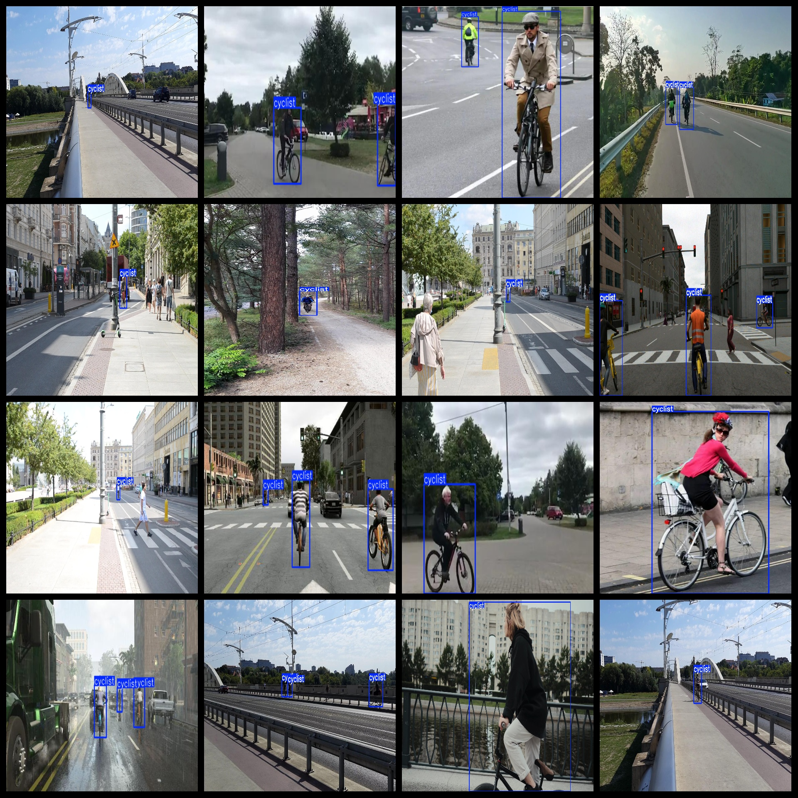

# Ride Bicycle Dataset 4663 imagesVOC+YOLO format

Cycling dataset 4663 VOC + YOLO format

Dataset format: Pascal VOC format + YOLO format (the txt file does not contain the split path, it only contains jpg images and corresponding VOC format xml files and yolo format txt files)

Number of images (number of jpg files): 4663

Number of annotations (number of xml files): 4663

Number of annotations (number of txt files): 4663

Number of categories: 1

The Github repository is: datasets_sl

Annotation class names: ["cyclist"]

Number of boxes labeled in each category:

cyclist frame count = 8870

Total boxes: 8870

Number of images per category:

cyclist annotated images = 4663

Image resolution: 1600x900

Use the labeling tool: labelImg

Dataset Augmentation: Yes

Rules for annotation: Draw a rectangle around the category.

Important note: The dataset does not have been divided into training, validation, and testing sets.

Special Disclaimer: This dataset does not guarantee the accuracy of the trained models or weight files.

Annotation and image details are as follows:

## Images

---

Here is a pay link on Stripe (https://buy.stripe.com/3cs8yP7sY87d0vu9AB). Please contact me lonlonago@foxmail.com after funding $89, and I will send you a complete data files, thank you!

